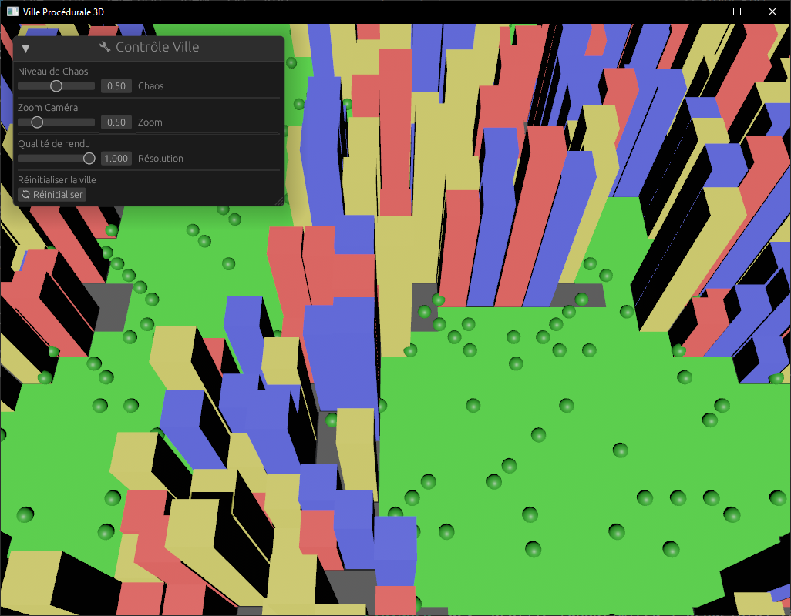
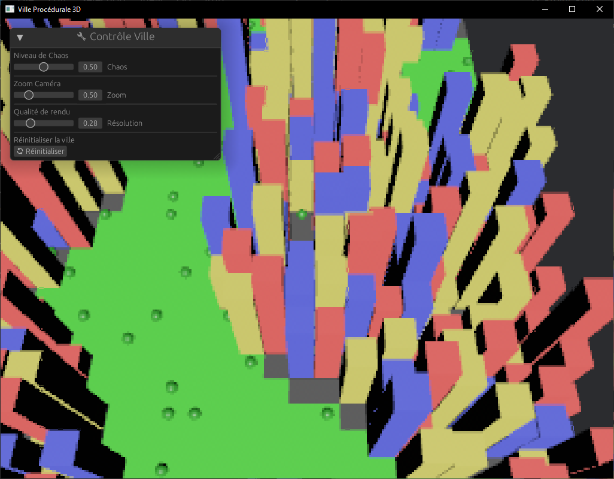
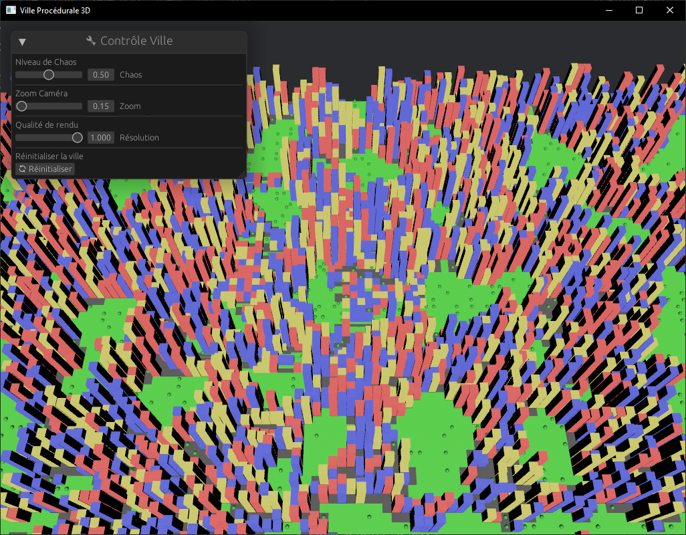
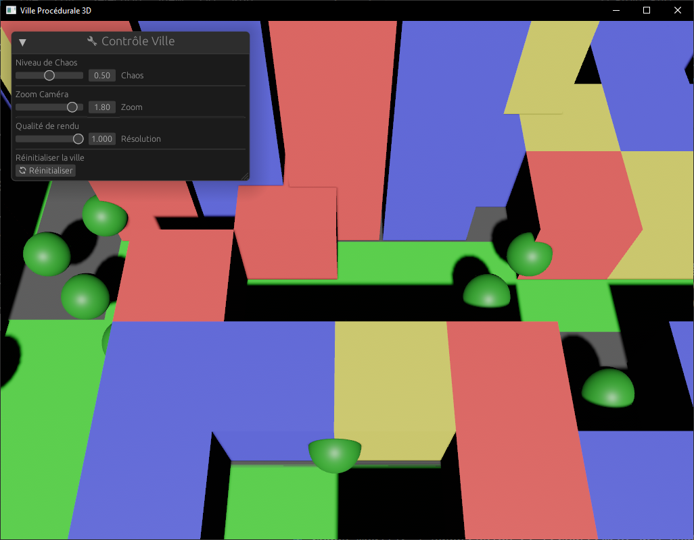
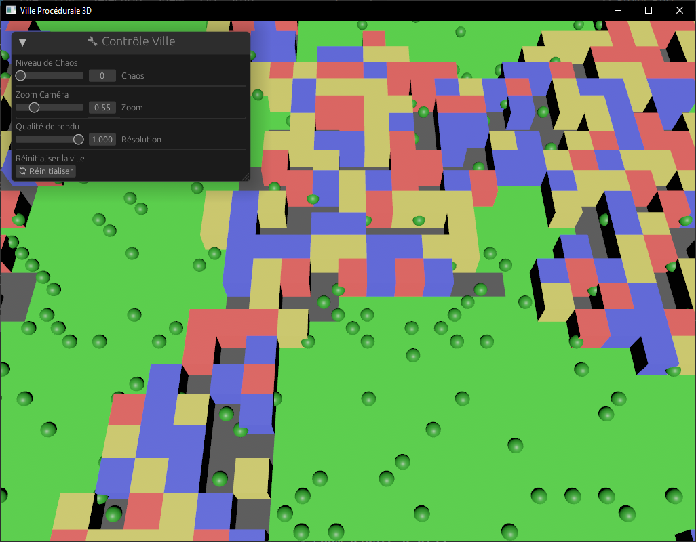
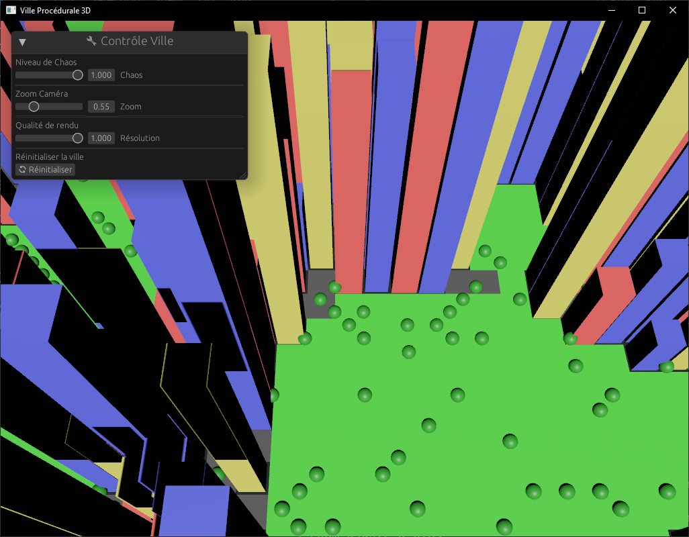

  
*Vue d'ensemble de la ville générée procéduralement.*

Parfait ! Voici la version finale du **README** en Markdown **avec les emojis conservés**, **les liens du sommaire fonctionnels**, et **toutes les parties explicatives détaillées** sans entrer trop dans la technique :

---

# 🏙️ Projet Rust – Ville 3D Procédurale avec Bevy

**Groupe :** Alexandre VIDELAINE / Alexandre GROSDIDIER / Théo LYONNET  
**Sujet :** Génération procédurale de ville interactive en 3D  
**Moteur :** [Bevy Engine](https://bevyengine.org/)  
**Langage :** Rust  

---

## 📚 Sommaire

1. [🎯 Objectif du projet](#🎯-objectif-du-projet)  
2. [🧩 Fonctionnalités principales](#🧩-fonctionnalités-principales)  
3. [🧠 Organisation du travail](#🧠-organisation-du-travail)  
4. [🌆 Étapes de construction du projet](#🌆-étapes-de-construction-du-projet)  
   - [4.1 Génération simple (taille fixe)](#41-génération-simple-taille-fixe)  
   - [4.2 Génération procédurale avec bruit](#42-génération-procédurale-avec-bruit)  
   - [4.3 Génération par chunks](#43-génération-par-chunks)  
5. [👤 Interactions utilisateur](#👤-interactions-utilisateur)  
   - [5.1 Caméra](#51-caméra)  
   - [5.2 Interface graphique](#52-interface-graphique)  
6. [🧠 Problèmes rencontrés et solutions](#🧠-problèmes-rencontrés-et-solutions)  
   - [6.1 Gestion de la caméra](#61-gestion-de-la-caméra)  
   - [6.2 Chunking et performance](#62-chunking-et-performance)  
   - [6.3 Interface utilisateur (EGUI)](#63-interface-utilisateur-egui)  
   - [6.4 Downscaling graphique](#64-downscaling-graphique)  
7. [📷 Captures d’écran](#📷-captures-décran)  
8. [🚀 Exécution du projet](#🚀-exécution-du-projet)  
   - [Prérequis](#prérequis)  
   - [Étapes](#étapes)  
9. [📌 Conclusion](#📌-conclusion)

---

## 🎯 Objectif du projet

Le but de ce projet était d’expérimenter la **génération procédurale en 3D**, en particulier dans un cadre de ville virtuelle.  
L'utilisateur doit pouvoir influencer la structure de la ville (rues, parcs, immeubles) en **temps réel**, notamment via un curseur contrôlant un niveau de **chaos**.

---

## 🧩 Fonctionnalités principales

- Génération procédurale de tuiles : parcs, routes, bâtiments
- Adaptation du monde via le curseur de chaos
- Optimisation du rendu avec un système de **chunking dynamique**
- Caméra libre et zoomable
- Interface graphique temps réel
- Tentative de **downscaling graphique** pour gain de performance

---

## 🧠 Organisation du travail

Nous avons structuré le projet en modules clairs (`camera.rs`, `city.rs`, `chunk.rs`, etc.) afin de séparer les responsabilités.  
Cela a permis de mieux collaborer et de rendre le code plus clair et maintenable.

---

## 🌆 Étapes de construction du projet

### 4.1 Génération simple (taille fixe)

La toute première version générait une grille statique de taille fixe (31x31), avec des entités prédéfinies (routes, parcs, bâtiments), sans aucune interaction utilisateur.

### 4.2 Génération procédurale avec bruit

Nous avons intégré du **bruit de Perlin** pour rendre la ville plus organique.  
Cela permettait de transformer la grille fixe en une ville cohérente mais aléatoire à chaque lancement.

### 4.3 Génération par chunks

Pour améliorer les performances :
- Le monde est divisé en zones (chunks) générées à la volée.
- Seules les zones proches de la caméra sont rendues.
- Lors d’un changement de chaos, les chunks sont supprimés et régénérés.

---

## 👤 Interactions utilisateur

### 5.1 Caméra

- Contrôle : flèches directionnelles pour se déplacer
- Zoom contrôlé via un **slider interactif**
- La caméra est identifiée via un tag `Main3dCamera` pour éviter les conflits

### 5.2 Interface graphique

Utilisation d’**EGUI via `bevy_egui`** :
- Curseur de **chaos**
- Curseur de **zoom**
- Curseur de **résolution**
- **Bouton de régénération** de la ville (supprime tout et recrée une nouvelle ville)

---

## 🧠 Problèmes rencontrés et solutions

### 6.1 Gestion de la caméra

- **Conflit de caméras** : 2D et 3D superposées → résolution via un tag `Main3dCamera`
- **Zoom trop intrusif** → uniquement la hauteur et la profondeur sont modifiées

### 6.2 Chunking et performance

- **Rendu de la ville entière** → trop lourd pour la machine
- **Implémentation du chunking** : seulement les zones proches sont affichées
- **Problème de rechargement** : détecté grâce à `is_changed()` sur le chaos

### 6.3 Interface utilisateur (EGUI)

- L’interface n’apparaissait pas → ajout d’une caméra **2D dédiée**
- Changements trop fréquents → optimisation en appliquant les changements uniquement quand la souris est relâchée

### 6.4 Downscaling graphique

- **Objectif** : alléger la charge GPU
- **Solution utilisée** :
  - rendu vers une texture basse résolution
  - affichage sur un `quad` géant

- **Limite importante** :  
  Le **pipeline de rendu de Bevy** continue à faire tous les calculs d'entités et lighting, **le gain est donc uniquement visuel**. On ne gagne **pas** en calcul ECS.

#### Améliorations futures

- Implémentation d’un **render graph personnalisé** pour palier à cette limite

---

## 📷 Captures d’écran

### Qualité de rendu
| Aucune réduction graphique             | Moyenne réduction graphique            | Forte réduction graphique             |
|----------------------------------------|-----------------------------------------|----------------------------------------|
|  |  |  |

### Zoom
| Vue éloignée                          | Vue rapprochée                         |
|---------------------------------------|----------------------------------------|
|  |  |

### Niveau de chaos
| Faible chaos                          | Fort chaos                             |
|---------------------------------------|----------------------------------------|
|  |  |

---

## 🚀 Exécution du projet

### Prérequis

Avant de commencer, assurez-vous d'avoir les éléments suivants installés sur votre machine :
- [Rust](https://www.rust-lang.org/tools/install) (version stable)
- Git pour cloner le dépôt

### Étapes

1. **Installer Rust** :
   ```bash
   rustup install stable
   ```

2. **Cloner ce dépôt** :
   ```bash
   git clone <URL_DU_DEPOT>
   cd Projet_Rust
   ```

3. **Lancer le projet** :
   ```bash
   cargo run
   ```

---

## 📌 Conclusion

Ce projet nous a permis de découvrir en profondeur :
- la **programmation procédurale**
- le **moteur Bevy** et l’architecture ECS
- la **gestion de scènes 3D dynamiques**
- les **limitations de performances graphiques** dans un moteur moderne

Il nous a aussi fait expérimenter les principes fondamentaux d’un moteur de jeu :
- caméra
- rendu
- interactions UI
- génération de contenu à la volée

Grâce à ce projet, nous avons produit une **ville générée procéduralement**, **interactive**, **personnalisable**, et **entièrement en Rust**.